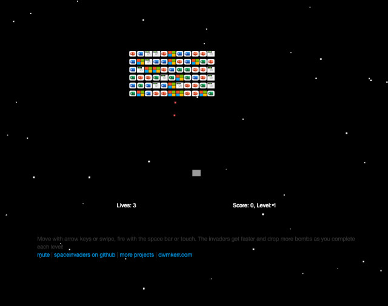

# Space Invaders

The classic Space Invaders game written in JavaScript as a learning exercise.

This fork is the Microsoft Edition.  Get your love on for Microsoft!

No jQuery or any other third party libraries, just raw JavaScript, CSS and HTML.

See it Live: [https://dwmkerr.github.io/spaceinvaders/](https://dwmkerr.github.io/spaceinvaders/)

[](https://dwmkerr.github.io/spaceinvaders/)

## Intro

[](https://repl.it/github/dwmkerr/spaceinvaders)

What's there to say? It's Space Invaders in JavaScript!

Create the game, give it a `div` to draw to, tell it when the keyboard is mashed and that's all you need to add Space Invaders to a website.

This is a simple learning exercise, so the JavaScript is deliberate kept all one file. There's no linting, testing, CI, or anything like that. If you want to see such patterns in front-end JavaScript, check out something like [angular-modal-service](https://github.com/dwmkerr/angular-modal-service).

## Adding Space Invaders to a Web Page

First, drop the `spaceinvaders.js` file into the website.

Now add a canvas to the page.

```html
<canvas id="gameCanvas"></canvas>
```

Next, add the Space Invaders game code. You create the game, initialise it with the canvas, start it and make sure you tell it when a key is pressed or released. That's it!

```html
<script>
//  Setup the canvas.
var canvas = document.getElementById("gameCanvas");
canvas.width = 800;
canvas.height = 600;

//  Create the game.
var game = new Game();

//  Initialise it with the game canvas.
game.initialise(canvas);

//  Start the game.
game.start();

//  Listen for keyboard events.
var pressedKeys = [];
window.addEventListener("keydown", function keydown(e) {
  var keycode = window.event.keycode || e.which;
    if(!pressedKeys[keycode])
      pressedKeys[keycode] = true;
    //  Supress further processing of left/right/space (37/29/32)
    if(keycode == 37 || keycode == 39 || keycode == 32) {
      e.preventDefault();
    }
    game.keyDown(keycode);
});
window.addEventListener("keyup", function keydown(e) {
  var keycode = window.event.keycode || e.which;
    if(pressedKeys[keycode])
      delete pressedKeys[keycode];
    game.keyUp(keycode);
});
</script>
```

## References

Other bits and pieces that are useful can be dropped here.

- The sounds came from [http://www.classicgaming.cc/classics/spaceinvaders/sounds.php](http://www.classicgaming.cc/classics/spaceinvaders/sounds.php)

## Publishing

On changes to the `master` branch, the GitHub Pages site will be automatically updated.
